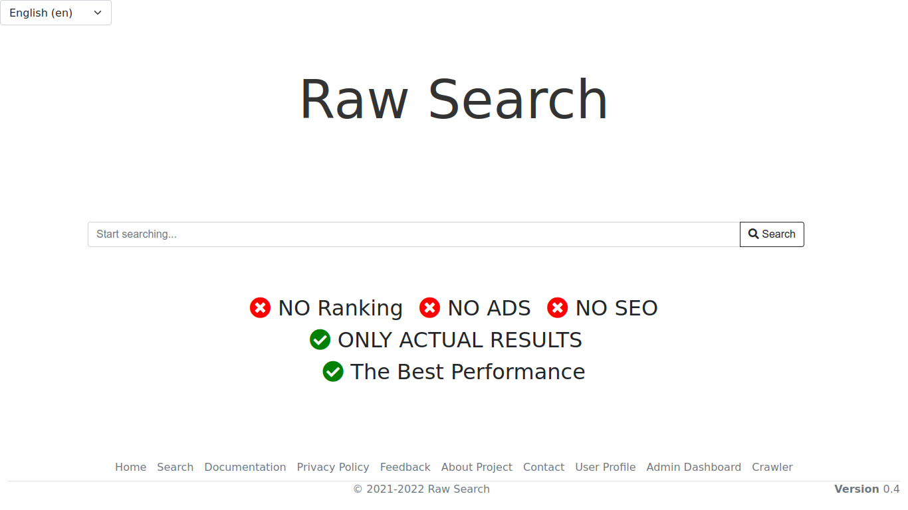
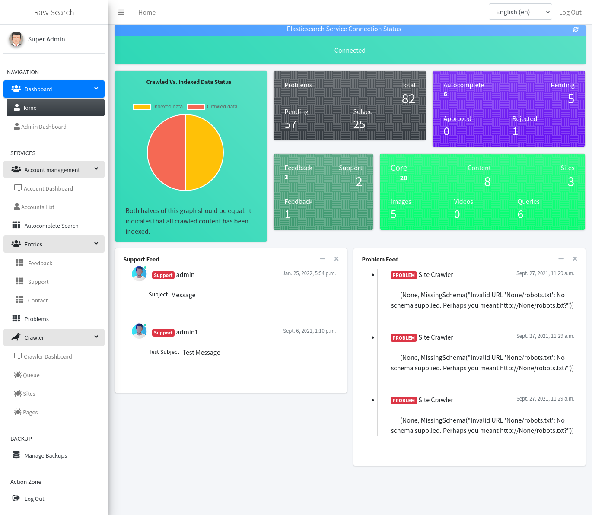

# Raw-Search

# WARNING: DON'T USE FOR PRODUCTION.

## Raw Search it's my diploma project for the topic "Design and implementation of a web search engine."
### Used Technologies in the project:

    - Django for backend
    - PostgreSQL and SQLite3 databases
    - Bootstrap and jQuery for frontend
    - Elasticsearch as the search engine

### The Project's Future

    • Adding more data mining tools
    • Improved searching algorithms
    • Add more analytical and analysis tools
    • Improve video search
    • Give a more useful services
    • User interface improvements

##### Front page

##### Admin Page

